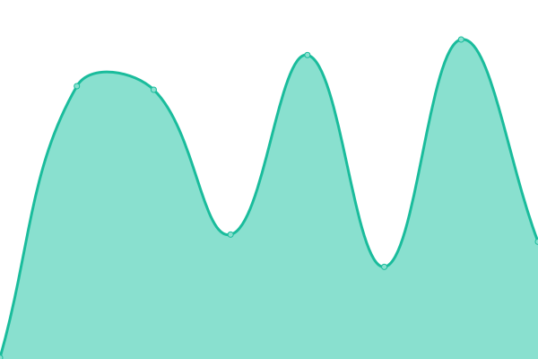

# [📈 Live Status](https://levackt.github.io/upptime-1): <!--live status--> **🟧 Partial outage**

This repository contains the open-source uptime monitor and status page for [Taariq Levack](https://levackt.github.io/upptime-1), powered by [Upptime](https://github.com/upptime/upptime).

With [Upptime](https://upptime.js.org), you can get your own unlimited and free uptime monitor and status page, powered entirely by a GitHub repository. We use [Issues](https://github.com/levackt/upptime-1/issues) as incident reports, [Actions](https://github.com/levackt/upptime-1/actions) as uptime monitors, and [Pages](https://levackt.github.io/upptime-1) for the status page.

<!--start: status pages-->
<!-- This summary is generated by Upptime (https://github.com/upptime/upptime) -->
<!-- Do not edit this manually, your changes will be overwritten -->
<!-- prettier-ignore -->
| URL | Status | History | Response Time | Uptime |
| --- | ------ | ------- | ------------- | ------ |
|  [Holodeck explorer](https://explorer.secrettestnet.io/) | 🟥 Down | [holodeck-explorer.yml](https://github.com/levackt/upptime-1/commits/HEAD/history/holodeck-explorer.yml) | 

 0ms
     
 | 

<a href="https://levackt.github.io/upptime-1/history/holodeck-explorer">0.00%</a>
    

|  [Faucet](https://faucet.secrettestnet.io/) | 🟩 Up | [faucet.yml](https://github.com/levackt/upptime-1/commits/HEAD/history/faucet.yml) | 

 270ms
     
 | 

<a href="https://levackt.github.io/upptime-1/history/faucet">100.00%</a>
    

|  [LCD](https://chainofsecrets.secrettestnet.io/syncing) | 🟩 Up | [lcd.yml](https://github.com/levackt/upptime-1/commits/HEAD/history/lcd.yml) | 

 319ms
     
 | 

<a href="https://levackt.github.io/upptime-1/history/lcd">98.17%</a>
    

|  [RPC](https://chainofsecrets.secrettestnet.io:26667) | 🟩 Up | [rpc.yml](https://github.com/levackt/upptime-1/commits/HEAD/history/rpc.yml) | 

 186ms
     
 | 

<a href="https://levackt.github.io/upptime-1/history/rpc">98.18%</a>
    

<!--end: status pages-->

[**Visit our status website →**](https://levackt.github.io/upptime-1)

## 📄 License

- Powered by: [Upptime](https://github.com/upptime/upptime)
- Code: [MIT](./LICENSE) © [Taariq Levack](https://levackt.github.io/upptime-1)
- Data in the `./history` directory: [Open Database License](https://opendatacommons.org/licenses/odbl/1-0/)
